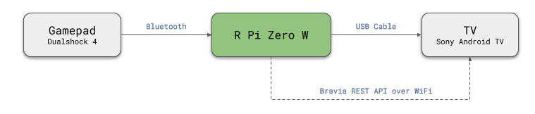

# Gamepad TV Remote

Turn your bluetooth gamepad as a TV remote control using a Raspberry Pi.

> **Warning**: This project requires a Raspberry Pi Zero W board. It doesn't work with a Raspberry Pi 3 or 4 boards as it requires the Raspberry Pi to use USB gadget mode.

## How Does it Work

The Raspberry Pi Zero W is plugged in to the TV's USB port and emulates a USB keyboard device. Button presses from the gamepad is translated into keyboard presses to the TV.



Although the concept should work for other TV/gamepad models, the project was mainly created for my own personal use cases. Which means the code is optimized for the devices that I own:

1. TV: Sony Bravia KD-65X9000E (Android TV)
2. Gamepad: Dualshock 4 (CUH-ZCT1)

## Usage 
Press the PS button on your Dualshock 4 controller to connect to the Raspberry Pi. The LED on the controller will turn green once it is recognized by the application. If you are using a Bravia TV it should turn on automatically.

Long press the PS button (4 seconds) to disconnect the controller. If you are using a Bravia TV it would be turned off automatically.

### Key Mapping

The default mapping is based on the Dualshock 4 controller.

| Gamepad Key       | Maps To                  | Remarks                   
|-------------------|--------------------------|---------------------------
| D-Pad             | Arrow Keys               |                           
| Options/Start     | Alt+Enter                | Android Home button       
| Share/Select      | -                        | Long press to lock/unlock 
| X Button          | Enter                    |                           
| Circle Button     | Escape                   | Android Back button       
| Square Button     | Media Play/Pause         |                           
| Triangle Button   | Backspace                |                           
| R2+Up, R2+Down    | Volume up/down           |                           
| R2+Left, R2+Right | Prev/Next Media          |                           
| R2+Square         | Toggle Mute              |                           
| PS Button/Mode    | Turn TV on/off           | Uses Bravia REST API

## Raspberry Pi Setup

1.  Download and write Raspbian Lite into an SD card. Make sure to enable WiFi and SSH. Insert the SD card into the Raspberry Pi and plug it into the TV's USB port to power it up. The following steps/commands should be done on the Raspberry Pi.

2. Install dependencies using `apt`.

```bash
sudo apt install python3-evdev python3-pyudev hidrd
```

3.  Install the code.

```bash
git clone https://github.com/rendyanthony/gamepad-tv-remote.git
cd gamepad-tv-remote
sudo ./install.py
```

4.  Pair your bluetooth gampepad to the Raspberry Pi (see the guide below)

5.  Reboot your Raspberry Pi. The services would be started automatically.

```bash
sudo reboot now
```

## Configuration

The code does use any configuration files (yet). If you need to modify the behavior you would need to edit code in `main.py`.

## Pair the Gamepad via Bluetooth

Follow the guide below to pair your bluetooth controller with the Raspberry Pi. The following guide is based on the Dualshock 4 controller but it should not differ much for other bluetooth controllers.

1.  Start the `bluetoothctl` tool on the Raspberry Pi

```bash
sudo bluetoothctl
```

2.  Run the following two commands in the bluetoothctl application

```
agent on
default-agent
```

3.  Start scanning for devices

```
scan on
```

4.  Set the gamepad into bluetooth pairing mode. On the Dualshock 4, press both the share and PS button at the same time to enter pairing mode. The LED on the Dualshock 4 will start flashing.

5.  The MAC address of the controller should show up on the command line. It should look something like this. Write down the address as we will use them in the subsequent commands.

```
[NEW] Device 90:FB:A6:BE:74:59 Wireless Controller
```

6.  Type `connect` follwed with the MAC address that you got from the previous step. The LED on the Dualshock 4 should turn blue.

```
connect 90:FB:A6:BE:74:59
```

7. Type `trust` followed with the MAC address to add the controller to the trusted list. This will allow the controller to automatically connect to your Raspberry Pi

```
trust 90:FB:A6:BE:74:59
```

8.  We are now done. You can quit the tool either by pressing `Ctrl+D` or typing `quit`.

## Useful Guides

These are the guides I used while developing this project:

1. [Using RPi Zero as a Keyboard](https://www.rmedgar.com/blog/using-rpi-zero-as-keyboard-setup-and-device-definition)
2. [Setting up PlayStation Controllers on the Raspberry Pi](https://pimylifeup.com/raspberry-pi-playstation-controllers/) &mdash; Pairing your PS4 Controller via BluetoothCTL
2. [BRAVIA REST API Specifications](https://pro-bravia.sony.net/develop/integrate/rest-api/spec/index.html)

